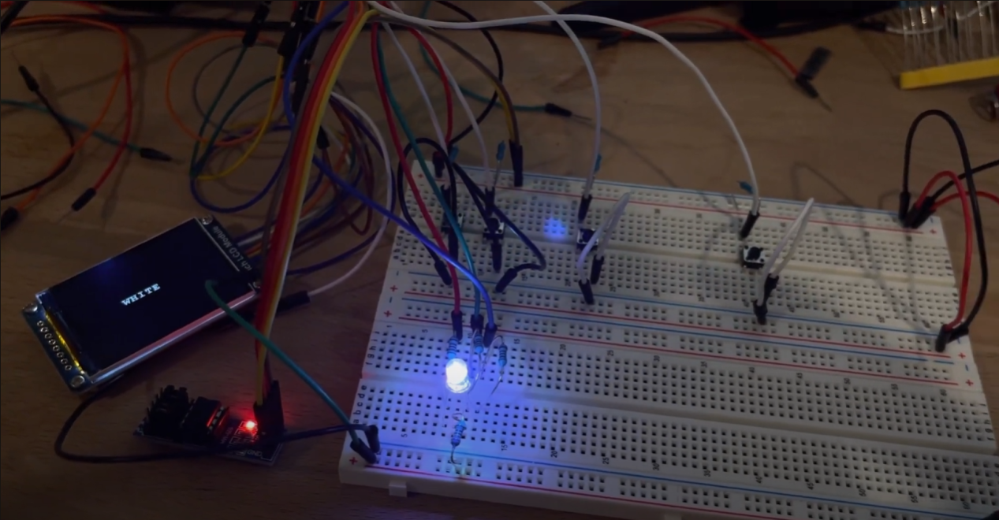

# UCR-CS120B-Final-Project

This was my final projected that I created for my embedded systems class at the University of California, Riverside. The system uses an Arduino Uno that holds the code for the system. The project has four buttons for inputs, one to cycle through different colors, one to go into party mode, one to choose a random color, and one to reset the color back to white. The project also uses a ST7789 LCD display and I borrowed a library provided by the manufacturer to produce text and colors to the green that corresponded to the currently selected color. An external EEPROM is used to store the state of the current color so that if power is loss in the system, on the next power up the system will remember what color the system was last set to before power loss.

[What I Wrote](https://github.com/ATranZone/UCR-CS120B-Final-Project/blob/main/rgbANDlcd.ino)

Video Demo: 

